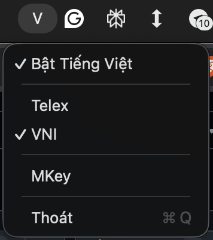
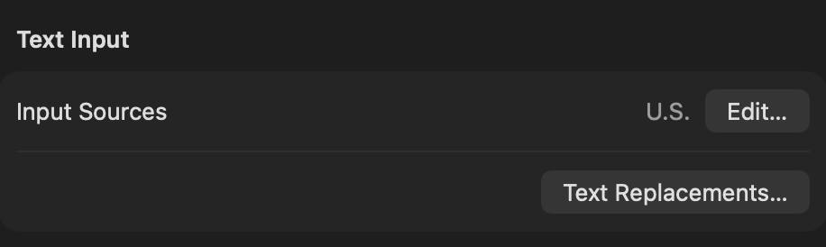

# Mkey

Bộ gõ tiếng Việt cho macOS — fork từ [OpenKey](https://github.com/tuyenvm/OpenKey), stripped down cho cá nhân.

## Tải về

[**Mkey-telex-v0.0.3.dmg**](https://github.com/mantrandev/Mkey/releases/tag/telex-v0.0.3)

## Screenshot



## Tính năng

- **Kiểu gõ:** Telex (cố định)
- **Bảng mã:** Unicode (precomposed)
- **Đặt dấu oà uý** (mặc định bật)
- **Chạy cùng macOS**
- **Phím tắt chuyển ngôn ngữ:** `Ctrl + Space` (mặc định)
- **Sửa lỗi autocorrect** trên Chrome, Safari, Firefox, Excel
- **Menu bar SwiftUI** — hiển thị `V` (tiếng Việt) hoặc `E` (tiếng Anh)

## Yêu cầu

macOS 13.0+.

**Gatekeeper:** Vì app chưa được notarize, cần bỏ chặn thủ công sau khi cài:  
*System Settings → Privacy & Security* → tìm `Mkey` → bấm **Open Anyway**.

**Accessibility:** Cấp quyền để app hoạt động:  
*System Settings → Privacy & Security → Accessibility* → bật `Mkey`.

**Text Input:** Để Mkey hoạt động mượt, chỉ giữ **một** input source là `U.S.` (English) trong *System Settings → Keyboard → Text Input → Input Sources*. Xoá hết các input source tiếng Việt (Telex/VNI) của macOS — Mkey tự xử lý phần gõ.



## Cài đặt

**Homebrew (khuyến nghị):**

```bash
brew tap mantrandev/tap
brew install --cask mantrandev/tap/mkey
```

**Thủ công:**

1. Tải `Mkey.dmg` từ [Releases](https://github.com/mantrandev/Mkey/releases)
2. Mở DMG, kéo `Mkey.app` vào thư mục `Applications`

**Sau khi cài (cả hai cách):**

1. Mở `Mkey` — hệ thống sẽ yêu cầu cấp quyền Accessibility
2. Vào *System Settings → Privacy & Security → Accessibility* → bật `Mkey`
3. Mở lại `Mkey`

## Build

Mở `Sources/macOS/Mkey.xcodeproj`, chọn scheme `Mkey`, build.

- **Debug:** bundle ID `com.mantrandev.mkey.dev`
- **Release:** bundle ID `com.mantrandev.mkey`

## Nguồn gốc

Fork từ [tuyenvm/OpenKey](https://github.com/tuyenvm/OpenKey) — GPL license.
