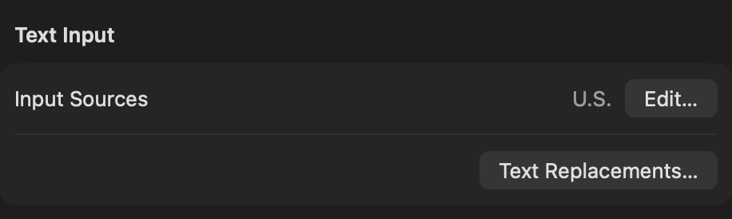

# Mkey

Fork từ [OpenKey](https://github.com/tuyenvm/OpenKey)

## Tải về

| Bản | Kiểu gõ | Link |
|---|---|---|
| Đầy đủ (Telex + VNI) | Telex / VNI | [Mkey-v0.0.6.dmg](https://github.com/mantrandev/Mkey/releases/tag/v0.0.6) |
| VNI only | VNI (cố định) | [Mkey-vni-v0.0.6.dmg](https://github.com/mantrandev/Mkey/releases/tag/vni-v0.0.6) |
| Telex only | Telex (cố định) | [Mkey-telex-v0.0.6.dmg](https://github.com/mantrandev/Mkey/releases/tag/telex-v0.0.6) |

## Screenshot


## Tính năng

- **Kiểu gõ:** Telex, VNI
- **Bảng mã:** Unicode
- **Phím tắt chuyển ngôn ngữ:** `Ctrl + Space`
- **Menu bar SwiftUI** — hiển thị `M` (tiếng Việt) hoặc `E` (tiếng Anh)
- **Gõ dấu** ở bất kì chỗ nào trong từ ở VNI
  - MinhBeo1 | MinhBe1o -> MinhBéo
  - Diu91 | D9i1u -> Đíu

## Yêu cầu

macOS 13.0+ (Ventura), Apple Silicon

**Gatekeeper:** Vì app chưa được notarize, cần bỏ chặn thủ công sau khi cài:  
*System Settings → Privacy & Security* → tìm `Mkey` → bấm **Open Anyway**.

**Accessibility:** Cấp quyền để app hoạt động:  
*System Settings → Privacy & Security → Accessibility* → bật `Mkey`.

**Text Input:** Để Mkey hoạt động mượt, chỉ giữ **một** input source là `U.S.` (English) trong *System Settings → Keyboard → Text Input → Input Sources*. Xoá hết các input source tiếng Việt (Telex/VNI) của macOS — Mkey tự xử lý phần gõ.



## Cài đặt

**Homebrew (khuyến nghị):**

```bash
brew tap mantrandev/tap
brew install --cask mantrandev/tap/mkey
xattr -dr com.apple.quarantine /Applications/Mkey.app
```

Bản cố định một kiểu gõ — chỉ cài **một** trong ba, chúng dùng chung `Mkey.app`:

```bash
brew install --cask mantrandev/tap/mkey-vni
brew install --cask mantrandev/tap/mkey-telex
```

**Nâng cấp:**

```bash
brew upgrade --cask mantrandev/tap/mkey
xattr -dr com.apple.quarantine /Applications/Mkey.app
```

Bước `xattr` là bắt buộc sau **mỗi** lần cài hoặc nâng cấp: Homebrew gắn `com.apple.quarantine` lên app, và vì app chưa notarize nên Gatekeeper chặn không cho mở. Cờ `--no-quarantine` đã bị bỏ từ Homebrew 6, và `HOMEBREW_CASK_OPTS="--no-quarantine"` cũng không còn tác dụng — đã kiểm chứng trên Homebrew 6.0.17.

**Thủ công:**

1. Tải `Mkey.dmg` từ [Releases](https://github.com/mantrandev/Mkey/releases)
2. Mở DMG, kéo `Mkey.app` vào thư mục `Applications`

**Sau khi cài (cả hai cách):**

1. Mở `Mkey` — hệ thống sẽ yêu cầu cấp quyền Accessibility
2. Vào *System Settings → Privacy & Security → Accessibility* → bật `Mkey`
3. Mở lại `Mkey`

## Build

Mở `Sources/macOS/Mkey.xcodeproj`, chọn scheme `Mkey`, build.

- **Debug:** bundle ID `com.mantrandev.mkey.dev`
- **Release:** bundle ID `com.mantrandev.mkey`

## Icon

App icon là pixel-art 8-bit sinh từ vector, không sửa `.icns` bằng tay:

```bash
./design/make-icon.sh
```

Script render `design/Icon.svg` qua Chrome headless ở đủ 10 kích cỡ iconset (16→1024) rồi `iconutil` đóng thành `Sources/macOS/ModernKey/Resources/Icon.icns`.

Chữ M vẽ trên lưới **16×16**, cố ý chọn 16 vì 1024/16, 512/16 … 16/16 đều là số nguyên — mọi biên pixel rơi đúng lưới ở mọi kích cỡ nên không sinh pixel antialias. Ảnh chỉ có 1 màu và 0 pixel alpha trung gian, nhờ đó `.icns` còn 42KB thay vì 130KB. Đổi sang lưới không chia hết (12×12, 24×24) sẽ mất tính chất này.
